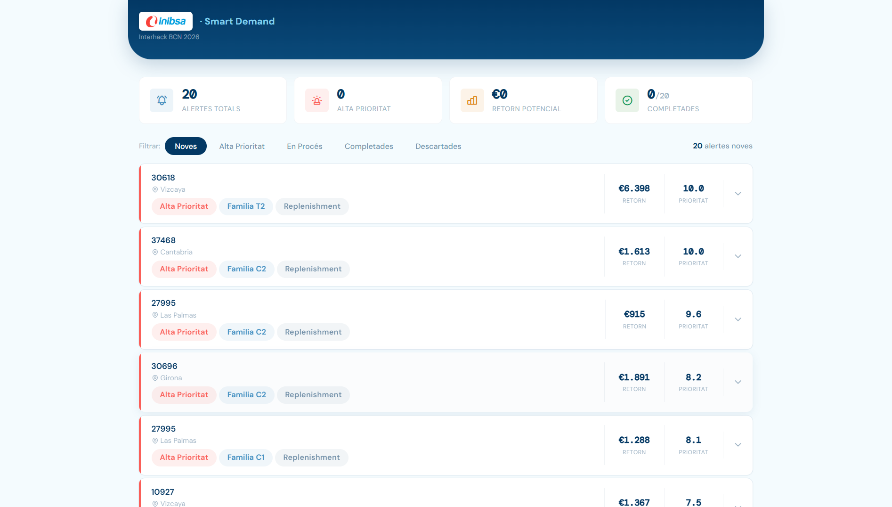
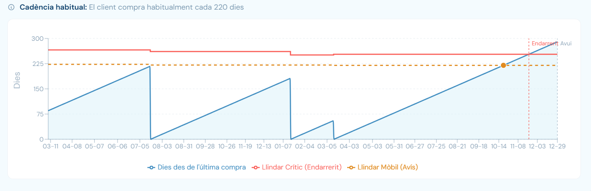
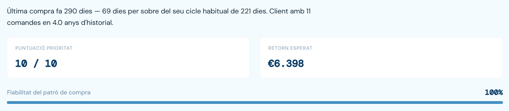
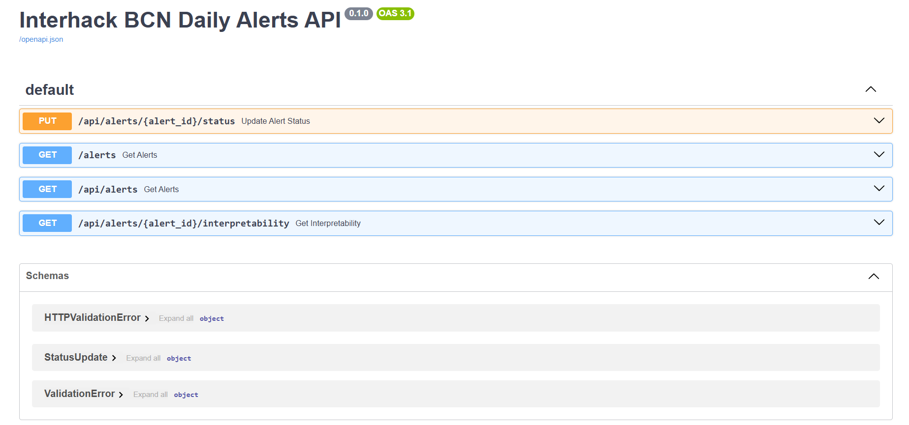
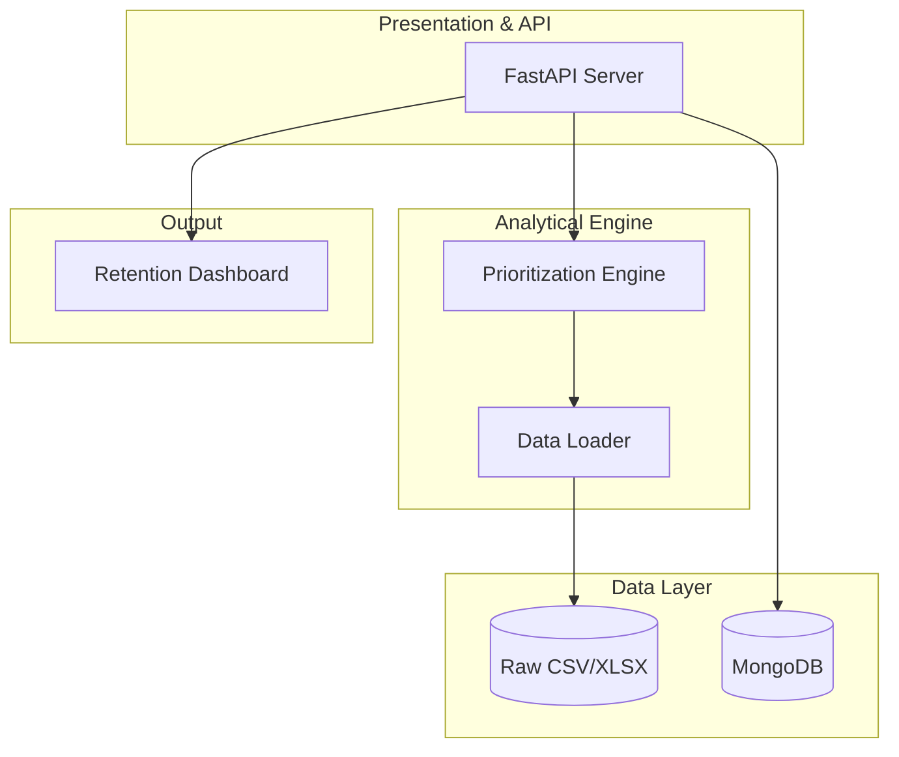
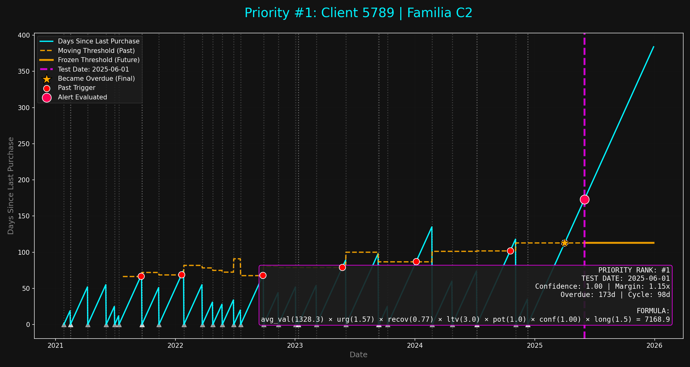

# 🚀 Smart Demand Signals
### Inibsa · Interhack BCN 2026 



[](https://www.python.org/)
[](https://fastapi.tiangolo.com/)
[](https://www.mongodb.com/)
[](https://www.docker.com/)
[](https://pandas.pydata.org/)

**Smart Demand Signals** is an advanced business intelligence and predictive analytics solution designed for **Inibsa**. It transforms five years of transactional data from 7,000 dental clinics into real-time, actionable alerts. By differentiating between high-frequency recurring purchases and technical pattern shifts, the system empowers sales teams to anticipate needs, capture missing demand, and mitigate churn risk.

---

## 🌟 Key Features

### 🧠 Dual-Track Prioritization Engine
The core analytical brain treats different product dynamics with surgical precision:



*   **Commodities (Recurring)**: Uses **Inter-Purchase Time (IPT)** analysis and **85th percentile peak tracking** to detect exactly when a client is overdue. Includes automated seasonality adjustments (e.g., August downturns).
*   **Technical Products (Variable)**: Focuses on **volume-drop detection** (>50% shifts) and pattern deterioration, identifying abandonment risks before they happen.

### 📊 Multi-Dimensional Scoring Framework
Alerts are not just flags; they are prioritized using a weighted model:



*   **Value (LTV)**: Prioritizes high-impact clients based on historical spend.
*   **Urgency**: Logarithmic scaling of overdue days to highlight critical windows.
*   **Recoverability**: A "cliff" penalty system that recognizes when a client is likely already lost.
*   **Potential Bonus**: Cross-references internal data with external potential to target "promiscuous" clients.
*   **Confidence**: Reliability score based on the length and consistency of the client's history.

### 🔌 Real-Time API & Persistence
*   **FastAPI Backend**: High-performance asynchronous API for fetching alerts.
*   **MongoDB Integration**: Persistent storage for alert statuses and historical snapshots.
*   **Auto-Sync**: Smart logic that triggers an engine recalculation if the data is stale (>20 mins).
*   **Status Management**: Track work-in-progress, completed, and discarded alerts.



### 🔍 Transparent Interpretability
Every alert includes an `Interpretability_JSON` payload, allowing frontends to visualize:
*   Historical purchase timelines.
*   Dynamic "Soft Trigger" vs. "Hard Overdue" thresholds.
*   The exact formula components that led to the final score.

---

## 🏗️ Technical Architecture



---

## 🛠️ Tech Stack

*   **Language**: Python 3.11+
*   **Web Framework**: FastAPI / Uvicorn
*   **Database**: MongoDB
*   **Analysis**: Pandas, NumPy, Scipy
*   **Visualization**: Matplotlib, Seaborn
*   **Ops**: Docker, Pydantic

---

## 🚀 Getting Started

### 1. Prerequisites
*   Python 3.11 or higher.
*   MongoDB running locally (port 27017).

### 2. Installation
```bash
# Clone the repository
git clone https://github.com/your-repo/interhackBCN.git
cd interhackBCN

# Install dependencies
pip install -r requirements.txt
```

### 3. Running the Solution
To start the API and trigger the first data load:
```bash
python src/api.py
```
The server will be available at `http://localhost:8000`. You can explore the interactive documentation at `/docs`.

### 4. Docker Deployment
```bash
docker build -t demand-signals .
docker run -p 8000:8000 -e MONGO_URI="mongodb://host.docker.internal:27017/" demand-signals
```

---

## 🧪 Simulation & Testing
The project includes a suite of retroactive testing tools to validate the engine's performance on historical data:



*   `src/retroactive_sim.py`: Runs a day-by-day simulation over a past period.
*   `src/large_scale_test.py`: Performance benchmarking.
*   `src/visualize_alerts.py`: Generates high-fidelity dark-themed plots for alert verification.

---

## 📂 Project Structure

*   `src/`: Main source code.
    *   `prioritization_engine.py`: Core logic for alert generation.
    *   `api.py`: FastAPI implementation.
    *   `data_loader.py`: Data ingestion and cleaning.
    *   `visualize_alerts.py`: Matplotlib visualization suite.
*   `data/`: Input datasets.
*   `docs/`: Detailed API and technical documentation.
*   `plots/`: Generated visual reports.
*   `outputs/`: Daily alert exports and CSV logs.

---

## 📄 License
This project was developed for the **Interhack BCN 2026** Hackathon. All rights reserved by Inibsa and the development team.